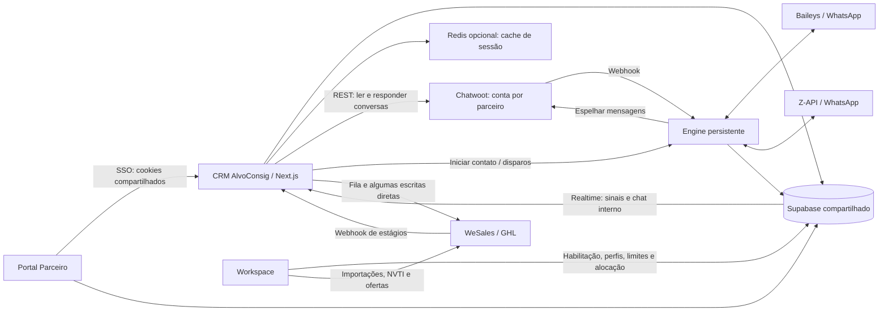

# Auditoria do CRM AlvoConsig — 04/09/2026

O código tem uma base funcional consistente, mas há problemas de autorização, confiabilidade das mensagens, paginação e carregamento que devem ser corrigidos antes de ampliar a operação. A lentidão tem causas estruturais identificáveis; ainda é necessário medir quanto cada uma contribui em produção.

## Escopo e limites

- Lidos: `PROJETOS/GRUPO.md`, contratos do CRM, aplicação web, engine WhatsApp, migrations e integrações relevantes do Workspace; conferido o contrato de cookies do Portal Parceiro.
- Revisões locais: CRM `b3c2fc9`; Workspace `210d349`.
- Auditoria de código e verificações locais. Não houve login nas contas dos parceiros, consulta ao banco de produção, pareamento de número, envio de mensagens, execução de cron, deploy ou alteração funcional.
- Não foram medidos tempos reais de tela, capacidade do Chatwoot, regiões dos serviços, filas remotas ou migrations efetivamente aplicadas. Ausência de mecanismo no código versionado não prova ausência de configuração manual no ambiente.
- Referências abaixo usam **CRM** = `brs-alvoconsig/apps/web`; **Engine** = `brs-alvoconsig/services/engine`; **Workspace** = `brs-workspace`. Linhas referem-se ao estado revisado.

## Mapa de dependências

O banco compartilhado e a conta Chatwoot por parceiro ajudam a integrar os sistemas, mas tornam a autorização no servidor indispensável: boa parte do acesso usa service role ou um usuário técnico administrador do Chatwoot. As regras da interface não substituem essas verificações.

## Achados por prioridade

**P0**: corrigir primeiro, por exposição de credencial. **P1**: corrigir antes de homologar operação ampliada. **P2**: confiabilidade, escala e experiência. “Confirmado no código” descreve o mecanismo identificado, não um incidente observado em produção.

### 01 — P0 — Validação de anexo permite enviar o token do Chatwoot para outra origem

**Evidência:** CRM `src/lib/crm/atendimento-actions.ts:1127` e `src/lib/chat/chatwoot.ts:156`.

`salvarAnexoDoChat` aceita uma URL com `url.startsWith(baseChat)`. Isso também aceita um domínio diferente que comece pelo mesmo texto. O downloader então faz `fetch` nessa URL com `api_access_token` da conta. Um usuário com `atendimento.salvar_arquivos` e um lead acessível satisfaz as verificações anteriores.

**Validação executada:** extraí a expressão real do arquivo e executei-a somente em memória: `https://chat.example.test.outside.test/arquivo.pdf` passa quando a base é `https://chat.example.test`, embora as origens sejam diferentes. Nenhuma requisição foi feita e nenhuma credencial foi utilizada no teste.

**Correção:** receber ID do anexo/mensagem, verificar a conversa e sua autorização, e resolver a URL no servidor. Comparar `new URL(...).origin` exatamente, restringir caminhos de anexos e tratar redirecionamentos sem encaminhar credenciais a outra origem. Não enviar o token do Chatwoot a URLs externas de storage. Limitar bytes durante a leitura, antes de alocar o arquivo inteiro.

**Aceite:** origens parecidas, URLs com credenciais, destinos externos e redirecionamentos indevidos são rejeitados; anexos válidos continuam funcionando.

### 02 — P1 — Ler uma mensagem não aplica a restrição de conversas do atendente

**Evidência:** CRM `src/lib/chat/actions.ts:258` e `:282`; comparação com `src/lib/crm/atendimento-actions.ts:379`.

`getMensagensParceiro(conversationId)` exige sessão habilitada e obtém a conta do parceiro, mas não confere permissão de visualizar atendimento nem se a conversa é acessível ao usuário. A listagem moderna aplica essas regras; a leitura direta usa o token técnico da conta e não as repete. A action antiga `getConversasParceiro` também exige apenas sessão e trata “meus” como qualquer conversa atribuída.

**Impacto:** conhecer ou alterar um ID de conversa da mesma conta pode permitir que um atendente leia conversas fora do seu escopo. Não foi demonstrado acesso entre parceiros diferentes; a conta é resolvida pela sessão.

**Correção:** guarda única para leitura, mensagens, anexos e operações sobre conversas, combinando parceiro, permissões, atribuição e política de fila. Remover ou proteger as actions antigas. Esconder menus não basta.

**Aceite:** testes negativos com atendentes A/B do mesmo parceiro, parceiro diferente e perfil sem atendimento; testar chamada direta da action, além da navegação.

**Chat interno:** as actions conferem permissão e participação no canal, mas a policy de SELECT adicionada em Workspace `supabase/migrations/20260903010000_crm_chat_realtime.sql:16` verifica somente participação e usuário ativo. Não confere `chat_interno.usar` nem habilitação do parceiro. Revogar a permissão ou desabilitar o CRM, mantendo usuário ativo/membro, não revoga essa leitura direta pela API/Realtime. Alinhar também a policy à regra efetiva de acesso e testar revogação com sessão ainda válida.

### 03 — P1 — Leituras por Server Actions formam uma fila e acumulam espera

**Evidência:** CRM `src/components/crm/atendimento/ConversaCentro.tsx:81`, `FilaConversas.tsx:129`, `PainelLead.tsx:57`, `atendimento/ui.tsx:109`.

Mensagens/comentários, eventos, templates, fixadas, usuários, resumo e pastas do lead são carregados por várias Server Actions. `Promise.all` no navegador não as transforma em requisições paralelas: o Next despacha essas ações uma de cada vez por cliente. Isso está documentado também nos guias instalados da versão do projeto (`next/dist/docs/01-app/02-guides/server-actions.md:28`).

Há consultas a cada 10 segundos para eventos/resumo e a cada 30 segundos para mensagens/fila, além dos sinais Realtime. Em uma conversa com lead, os quatro loops principais geram aproximadamente **20 chamadas de actions por minuto por aba visível**, sem contar montagem, cliques e eventos. É uma contagem derivada do código, não medição de tráfego. O helper de polling não espera a execução anterior acabar. Cada sinal também inicia novas buscas sem agrupar rajadas.

**Impacto:** uma integração lenta pode atrasar leituras e respostas que entram atrás na fila. Realtime reduz espera até detectar mudanças, mas ainda dispara leituras caras.

**Correção:** bootstrap agregado com paralelismo no servidor; leituras frequentes por GET autenticado com cache por usuário/parceiro, deduplicação e cancelamento; dados iniciais no servidor quando apropriado; actions para mutações. Atualizar somente o bloco afetado e agrupar sinais. Poll de segurança sem sobreposição.

**Aceite:** registrar waterfall do navegador, duração de cada dependência e latência ao trocar conversa/enviar mensagem. A melhora precisa ser comprovada em percentis, não apenas pelo spinner.

Referência: [Server Actions do Next.js](https://nextjs.org/docs/app/guides/server-actions).

No chat interno, `getCanais` (`src/lib/crm/chat-interno-actions.ts:95`) ainda dispara duas consultas por canal para preview/não lidas a cada atualização da lista, além das consultas de usuários/membros. O paralelismo reduz a espera individual, mas mantém o crescimento de carga proporcional a usuários × canais. Substituir por consulta agregada ou resumo atualizado por evento.

### 04 — P1 — A autenticação ainda faz uma chamada remota antes das actions

**Evidência:** CRM `src/proxy.ts:84`, `src/lib/auth/session.ts:83` e `src/lib/auth/sessao-cache.ts`.

A resolução da sessão usa `getClaims()` e caches L1/L2, mas o proxy continua chamando `getUser()` nas rotas `/crm` e `/atendente`, inclusive nos POSTs das actions. Portanto, o cache de sessão não elimina essa dependência do serviço Auth. O cliente Redis também não define um orçamento explícito de timeout nessa camada.

**Correção:** medir separadamente proxy, Auth, Redis e consultas de sessão. Avaliar validação de claims no proxy preservando refresh, troca obrigatória de senha, logout diário e política de revogação. Confirmar o tipo de chave JWT usado: validação local depende da configuração. Configurar orçamento curto e degradação controlada do cache, sem ampliar TTL de permissões indiscriminadamente.

### 05 — P1 — Conversas e histórico ficam incompletos por falta de paginação na UI

**Evidência:** CRM `src/components/crm/atendimento/FilaConversas.tsx:132`, `src/lib/crm/atendimento-actions.ts:389`, `src/lib/chat/chatwoot.ts:100`, `src/lib/chat/actions.ts:282`.

A fila não envia `page`; o cliente usa página 1. Só depois dessa página são filtrados atendente, lead, inbox e disparos sem resposta. Um atendente pode ter conversas válidas em páginas seguintes e ver uma fila vazia. Os metadados de paginação não chegam à UI.

O cliente de mensagens aceita `before`, mas a action e a tela não o expõem; cada atualização substitui a lista pelo lote recente. Histórico maior que um lote não é recuperável pela tela atual.

**Correção:** filtrar antes de paginar quando possível; se houver regras locais, construir um índice paginável ou continuar buscando páginas até preencher a página autorizada. Expor cursor para histórico e mesclar mensagens por ID. Busca por CPF/IDWS precisa consultar o índice correspondente, não depender só da primeira página do Chatwoot.

**Aceite:** conversa atribuída localizada além da primeira página deve aparecer; histórico antigo deve ser recuperável sem duplicar mensagens.

Referências: [Lista de conversas](https://developers.chatwoot.com/api-reference/conversations/conversations-list), [Paginação de mensagens](https://developers.chatwoot.com/api-reference/messages/get-messages).

### 06 — P1 — Limite anunciado de anexos é incompatível com o transporte

**Evidência:** CRM `src/lib/chat/actions.ts:317`, `ConversaCentro.tsx:20`, `next.config.ts`.

A UI e a action aceitam 15 MB, mas a configuração não altera o limite padrão de 1 MB para Server Actions. A requisição grande pode ser rejeitada antes da validação amigável da aplicação. Na Vercel, aumentar apenas o limite do Next também não resolve: Functions têm limite de payload de 4,5 MB.

**Correção:** upload direto autorizado para storage, seguido de processamento por referência no engine, com posse, MIME e tamanho verificados no servidor. Definir estados de progresso e erro coerentes com os limites de todos os trechos.

**Aceite:** texto, imagem, documento e áudio nos tamanhos abaixo/acima de 1 MB, 4,5 MB e do limite de produto, inclusive gravação longa de áudio.

Referências: [Limite de Server Actions](https://nextjs.org/docs/app/api-reference/config/next-config-js/serverActions), [Limites de Vercel Functions](https://vercel.com/docs/functions/limitations).

### 07 — P1 — Webhooks WhatsApp recebem sucesso antes da persistência

**Evidência:** Engine `src/server.ts:218` e `:225`; `src/baileys.ts:182`; `src/bridge.ts:324`.

Os webhooks do Chatwoot e da Z-API iniciam o processamento em background e retornam sucesso imediatamente. Se houver falha depois ou reinício do processo, não existe uma fila durável desse evento para retomada. O receptor Baileys captura erros e registra em log, sem mecanismo local de replay.

**Correção:** persistir evento validado e sua chave de deduplicação antes de responder sucesso; worker com tentativas, backoff, registro de erro definitivo e reprocessamento. Eventos de entrada e saída precisam de trilha correlacionável até o provedor.

**Aceite:** derrubar o worker após receber o webhook e retomá-lo deve preservar o trabalho; indisponibilidade temporária do Chatwoot não deve perder mensagem de entrada.

### 08 — P1 — Envios não têm idempotência persistente nem confirmação de entrega completa

**Evidência:** Engine `src/server.ts:81`, `:169`, `src/bridge.ts:143`, `:288`, `:324`; CRM `src/lib/chat/engine.ts:14`, `src/app/api/cron/disparo-whatsapp/route.ts:162`.

O endpoint de envio não recebe uma chave de operação. Se o WhatsApp aceitar a mensagem e a resposta ultrapassar o timeout de 25 segundos do CRM, uma nova tentativa pode enviá-la novamente. O ID WhatsApp é gravado como atributo no Chatwoot, sem uma trava persistente de deduplicação no fluxo revisado. Os Sets em memória servem para suprimir alguns ecos; não cobrem reinícios, webhooks repetidos nem o envio direto Z-API pelo endpoint.

O sucesso de `responderConversaParceiro` confirma criação da mensagem no Chatwoot, antes da entrega pelo engine. Há nota privada em algumas falhas, mas não um estado completo de enviado/entregue/lido/falhou sincronizado com ACKs do WhatsApp.

**Correção:** ID estável de operação ponta a ponta, outbox e associação persistente entre IDs CRM/Chatwoot/WhatsApp. Tratar timeout de envio como resultado incerto e reconciliar antes de repetir. Distinguir aceitação de entrega na interface.

**Aceite:** repetir o mesmo webhook e simular timeout após envio real deve produzir uma única mensagem no aparelho; erro deve aparecer de forma acionável.

### 09 — P1 — Jobs podem ficar presos; a fila de disparos pode bloquear outros parceiros

**Evidência:** CRM `src/app/api/cron/wesales-queue/route.ts:268`, `:285`; `src/app/api/cron/disparo-whatsapp/route.ts:51`, `:89`.

Os claims condicionais evitam que duas execuções processem a mesma linha simultaneamente, mas não têm lease com vencimento. Um processo encerrado após marcar `processando`/`enviando` deixa o item fora das próximas seleções; não encontrei recuperador no código/migrations revisados.

O disparo seleciona até 500 itens vencidos antes de escolher parceiros e verificar se a campanha está ativa. Se esses 500 forem de uma campanha pausada, o primeiro item volta a pendente sem mudar a posição: outro parceiro pode ficar indefinidamente fora da janela.

O limite de um item por parceiro por cron de minuto também impõe, em operação normal, cerca de um envio/minuto por parceiro, independentemente de delays menores configurados. Duas execuções sobrepostas podem pegar linhas diferentes do mesmo parceiro; a trava é por item, não por parceiro.

**Correção:** claim transacional com lease e política para resultado de envio incerto; selecionar campanhas ativas e distribuir trabalho por parceiro no banco; serializar por parceiro/instância; aplicar cadência a partir do envio efetivo. A recuperação precisa vir junto da idempotência do item 08.

**Aceite:** reinício após claim, dois workers, 500 itens pausados do parceiro A e item ativo de B, retomada de campanha e comparação entre cadência configurada e real.

### 10 — P1 — Reprovação de oferta vinda do WeSales viola constraint antes da correção

**Evidência:** CRM `src/app/api/wesales/webhook/route.ts:96`; Workspace `supabase/migrations/20260829100000_crm_ofertas.sql:56`.

O webhook tenta alterar `estagio` para `reprovadas_operacional` sem preencher `reprovada_no_estagio`, pretendendo preencher o campo em um segundo UPDATE. A constraint exige ambos coerentes já na primeira escrita. Para uma oferta antes não reprovada e com origem nula, o primeiro UPDATE falha; seu `error` não é inspecionado e o evento pode ser marcado como processado.

**Correção:** obter etapa anterior e escrever os dois campos atomicamente; verificar todos os erros de persistência. Evento só fica processado quando a atualização e o rollup necessários realmente terminarem.

**Aceite:** mover uma oferta de negociação para reprovada no WeSales deve gravar a origem e atualizar o espelho; falha de banco deve ficar pendente/erro para reprocessamento.

### 11 — P1 — Duplicidade por telefone pode vincular CPFs diferentes no WeSales

**Evidência:** CRM `src/app/api/cron/wesales-queue/route.ts:122`; `src/lib/crm/atendimento-actions.ts:711`.

Quando criar contato retorna `duplicateOfId`, o worker adota esse contato sem conferir se o CPF corresponde. Na criação receptiva, o código ainda pode atualizar campos personalizados, incluindo CPF/parceiro, nesse ID. Telefone compartilhado ou reciclado torna possível associar pessoas distintas.

**Correção:** CPF e regras de titularidade como identificação principal; telefone conflitante deve gerar uma pendência de reconciliação, sem atribuição automática nem sobrescrita. Conferir contratos de campos compartilhados com NuAzul/CLT, que usam a mesma base de contatos segundo o GRUPO.md.

**Aceite:** dois CPFs com mesmo telefone não devem fundir cadastros nem transferir dados de crédito entre pessoas.

### 12 — P2 — Dashboard e contadores podem calcular apenas parte da base

**Evidência:** CRM `src/lib/crm/actions.ts:1085`, `src/lib/crm/disparo-actions.ts:77`.

O resumo baixa contatos e calcula totais/ranking em memória, sem paginação. O progresso de disparo também conta as linhas retornadas. O Supabase normalmente limita o número de linhas retornadas por consulta; a configuração real deste banco não foi inspecionada. Bases acima do limite terão métricas truncadas. Aumentar o teto apenas aumenta custo e tráfego.

Além disso, `valorEmNegociacao` soma `margem_novo`. É necessário confirmar a regra de negócio: margem disponível não equivale automaticamente ao valor liberado das propostas.

**Correção:** agregações SQL/RPC por parceiro, período e estado, índices alinhados e cache curto dos resultados. Calcular valores a partir da entidade correta e rotular a métrica de forma inequívoca.

**Aceite:** resultados iguais ao SQL de controle numa base superior ao limite configurado, inclusive ranking e progresso de campanha.

Referência: [Retorno e paginação do Supabase](https://supabase.com/docs/reference/javascript/select).

### 13 — P2 — Ciclo de vida do Baileys precisa de controle de reconexão e encerramento

**Evidência:** Engine `src/baileys.ts:117`, `:151`, `:168`, `:197`; `src/index.ts`.

Ao fechar a conexão, a sessão é removida do Map; a próxima `conectar` não encontra o contador anterior, reiniciando as tentativas. Isso impede o backoff crescente pretendido. O timer de reconexão não é armazenado para cancelamento no logout. Também não há handler de encerramento gracioso que aguarde a persistência de credenciais debounced.

Todas as instâncias com sessão salva são abertas na inicialização. Não há ownership distribuído por instância no código: duas réplicas simultâneas podem disputar o mesmo número. A quantidade de réplicas/deploy overlap real não foi verificada.

**Correção:** estado de reconexão fora do socket, timers canceláveis, geração/identidade do socket para ignorar eventos antigos, flush de credenciais ao encerrar e lease por instância antes de escalar réplicas.

**Aceite:** várias quedas seguidas com backoff crescente; logout durante espera sem reconectar; reinício com sessão preservada; duas réplicas sem disputa.

### 14 — P2 — Z-API tem estado de conexão e desconexão incompletos

**Evidência:** Engine `src/server.ts:33`, `:44`, `:52`; CRM `src/lib/chat/actions.ts:176`, `:204`.

Conectar/status da Z-API consulta o provedor, mas não persiste seu status/telefone no banco. A action adiciona `engine_conectada`, preservando o `status` antigo. O endpoint de desconexão só executa operação real para Baileys e retorna sucesso para Z-API sem desconectá-la.

**Correção:** definir claramente se o botão desconecta no provedor ou apenas desativa o canal; implementar a operação e refletir estado real no banco/UI. Receber callbacks de conexão/desconexão. Tratar credenciais inválidas e timeout separadamente de “desconectada”.

**Aceite:** conectar e desconectar uma receptiva Z-API deve alterar o estado real e a indicação da tela de forma consistente.

### 15 — P2 — Sincronização WeSales ainda mistura fila e escritas diretas sem recuperação uniforme

**Evidência:** CRM `src/lib/crm/atendimento-actions.ts:689`, `:727`, `:825`; `src/lib/crm/atendimento-shared.ts:193`; `src/lib/wesales/client.ts:54`.

Notas e outras operações usam API direta best-effort, além da fila. Uma falha pode deixar o dado local salvo e o remoto sem atualização. Um lead receptivo criado sem CPF cujo cadastro remoto falhe fica sem `idws`; a condição `if (idws || cpf)` não enfileira recuperação. O cliente WeSales tem retry de 429, mas não define timeout total explícito.

**Correção:** persistir a intenção de sincronizar na mesma transação do dado local; processar e reconciliar com estados visíveis. Identificação de lead sem CPF precisa de política própria. Coordenar o consumo da API compartilhada com o Workspace e outros serviços, sem depender só de limites por execução.

O cron WeSales também aceita requisições sem autenticação quando `CRON_SECRET` está ausente (`route.ts:258`), ao contrário do cron de disparo. Deve falhar fechado. Não foi verificado se a variável está ausente no ambiente publicado.

### 16 — P2 — Sinais Realtime têm limpeza declarada, mas sem agendamento versionado

**Evidência:** Workspace `supabase/migrations/20260903020000_chat_atendimento_sinais.sql:63`.

A migration cria a função que remove sinais antigos e comenta sobre um cron horário, mas não o agenda. Não encontrei chamada à função no código revisado. Pode existir configuração manual no banco; é necessário verificar.

**Correção:** verificar e versionar o agendamento, monitorar volume/idade dos sinais e capturar o estado da assinatura Realtime na UI. Se a assinatura cair, o usuário deve perceber que está usando atualização periódica.

### 17 — P2 — Cursor do chat interno pode saltar mensagens não recuperadas

**Evidência:** CRM `src/components/crm/chat-interno/ChatInterno.tsx:67`, `:114`; `src/lib/crm/chat-interno-actions.ts:177`.

O poll usa `created_at > cursor`, e cada mensagem recebida ao vivo também avança esse cursor. Depois de uma interrupção, se uma mensagem nova chegar por Realtime antes da recuperação das anteriores, o cursor salta para ela: o próximo poll não busca o intervalo perdido. O cursor também usa só timestamp, sem desempate por ID. Não há paginação para buscar mensagens anteriores ao lote inicial de 200.

**Correção:** separar cursor de histórico confirmado do último evento ao vivo, recuperar lacunas ao reconectar, mesclar por ID e usar cursor estável com desempate. Guardar cursor por canal e descartar respostas antigas após troca de canal.

**Aceite:** desconectar Realtime, receber mensagens durante a queda, reconectar com uma mensagem nova antes do poll; todas devem aparecer. Testar troca rápida de canais e mensagens com timestamps iguais.

## Pontos positivos já existentes

- Conta Chatwoot por parceiro e filtros por parceiro em grande parte das actions.
- Cofre de credenciais e sessão Baileys cifrada; tokens sensíveis tratados no servidor.
- Matriz de permissões compartilhada: conferência local encontrou as mesmas **34 chaves** no CRM e Workspace.
- Workers com claim condicional e retry em alguns caminhos; boa base para adicionar leases e idempotência.
- Realtime já existe para sinais do atendimento; polling pausa com aba oculta.
- A consulta de status das instâncias já foi agregada no servidor; essa melhoria pode orientar o restante da tela.
- Engine já distingue envio confirmado com falha de espelhamento em parte do fluxo, evitando reportar tudo simplesmente como falha de envio.

## Ordem de execução sugerida

1. **Fechar autorização e anexos:** itens 01, 02 e autenticação obrigatória dos crons. Testes negativos por perfil/parceiro.
2. **Garantir integridade:** itens 07–11 e 15. Fila durável, idempotência, lease, tratamento de erro e reconciliação. Não adicionar retry cego a mensagens.
3. **Corrigir experiência visível:** paginação, upload e bootstrap de atendimento; retirar leituras periódicas da fila de actions. Medir antes/depois.
4. **Homologar números e escala:** ciclo Baileys/Z-API, reconexão, anexos, entrega, observabilidade e capacidade do Chatwoot.
5. **Consolidar operação:** agregações do dashboard, retenção, contratos de integração e atualização dos READMEs. O README do engine ainda diz que nada executa na fase 1, apesar de já conter implementação extensa.

Evitaria uma reescrita geral. Os problemas identificados podem ser atacados por contratos e fluxos delimitados, aproveitando o que já está implementado.

## Homologação necessária antes de ampliar o uso

Usar parceiros/usuários de teste e números sob controle da equipe. Os testes abaixo são propostos; não foram executados contra os serviços reais nesta auditoria.

| Área | Cenários | Critério de aceite |
|---|---|---|
| Permissões | Master, operacional, atendentes A/B, outro parceiro, desativado | Nenhuma leitura/escrita fora do escopo, inclusive por action direta |
| SSO | Portal → CRM; atendente; senha provisória; meia-noite; logout | Sessão e bloqueios coerentes; cookie do Workspace preservado |
| WhatsApp | Parear, reiniciar engine, derrubar rede, logout, sessão substituída | Recuperação previsível sem loops, disputa ou sessão ressuscitada |
| Mensagens | Cliente inicia; CRM inicia; duas respostas simultâneas; webhook repetido | Ordem e IDs rastreáveis; sem duplicidade; erro recuperável |
| Anexos | Imagem, PDF, áudio gravado, vídeo; limites; origem inválida | Entrega confirmada, limite consistente e nenhuma saída de token |
| Histórico/fila | Mais de uma página, busca por telefone/CPF/IDWS, conversa antiga | Nenhuma conversa autorizada invisível por truncamento |
| Campanhas | Pausa/retomada, 500 pendências, vários parceiros, dois workers | Justiça por parceiro, cadência correta e recuperação após crash |
| WeSales | Reprovação, erro de banco, 429, lead sem CPF, telefone compartilhado | Nenhuma falsa confirmação ou mistura de titularidade |
| Realtime | Queda/reconexão, aba oculta, rajada de mensagens | Atualização recupera; rajadas não acumulam buscas ilimitadas |
| Carga | 1/10/30 atendentes com dados representativos | Medir p50/p95 de abrir tela, trocar conversa e enviar; medir erros e filas |

Como metas iniciais de produto, sujeitas a benchmark: troca de conversa p95 abaixo de 1 segundo com sessão quente; confirmação visual de envio sem esperar trabalho secundário; atualização recebida em poucos segundos. Essas são metas propostas, não resultados atuais.

Monitorar por etapa: navegador → proxy/Auth → consultas → Chatwoot/engine → WhatsApp. Registrar correlation ID, duração, código de erro, profundidade/idade de fila, conexão por instância e atrasos de sincronização. Evitar conteúdo de mensagens e credenciais nos logs. Conferir regiões e recursos de Vercel/Supabase/Redis/Chatwoot antes de atribuir a lentidão à infraestrutura.

## Verificações efetivamente realizadas

- `tsc --noEmit --incremental false -p apps/web/tsconfig.json`: passou.
- `tsc --noEmit --incremental false -p services/engine/tsconfig.json`: passou.
- Reprodução offline da guarda de URLs: confirmou aceitação de origem diferente pelo prefixo.
- Comparação das chaves de permissão CRM/Workspace: 34 chaves coincidentes.
- Consulta dos guias locais do Next e documentação primária de Next, Vercel, Supabase e Chatwoot para comportamento/limites citados.
- Não executei build de produção, lint completo, testes E2E ou teste de carga. A checagem de tipos não certifica segurança, entrega de mensagens nem comportamento remoto.

Este relatório é o único arquivo criado pela auditoria; não altera o GRUPO.md nem implementa as correções.
